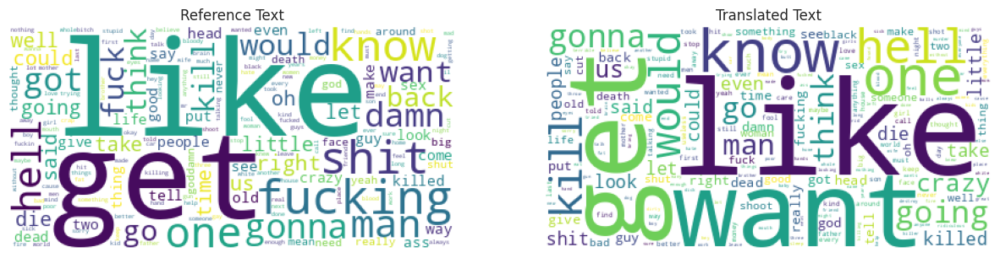
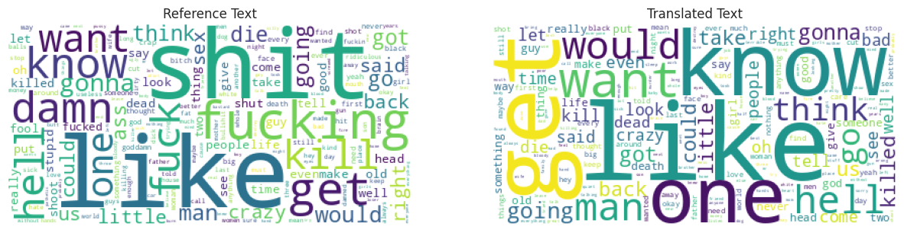
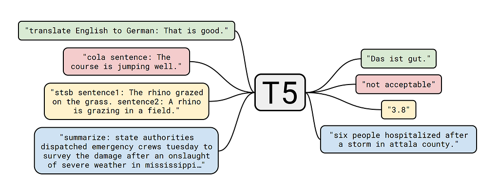

# Final Report

## Introduction

In this report, we present the process and results of building a solution for reducing toxicity in
text. The objective was to develop a model that can paraphrase sentences and make them less toxic.
I explored various approaches and evaluated their performance using different metrics.

## Data Analysis

I discovered that there were some records with translated toxicity score greater than the reference
one. So I swapped translation and reference for these records. Also, I visualized word clouds for
all reference and translated texts before and after preprocessing:

We can see a lot of toxic and profane words in the reference cloud after preprocessing, while there
almost no such words
in the translated set, which is expected. However, in raw dataset we cannot see such clear
distinction.

## Model Specification

The T5 model is a powerful transformer-based model that stands for "Text-To-Text Transfer
Transformer." It is pre-trained on a large corpus of text data and can be fine-tuned for various
downstream tasks, including paraphrasing and text generation.

## Training Process

I did not fine-tune `T5` by myself, but the model I use was firstly trained on multiple paraphrasing
datasets and then fine-tuned on ParaNMT. Source code is available
on [GitHub](https://github.com/s-nlp/detox/blob/main/emnlp2021/style_transfer/mining_parallel_corpus/finetune_t5_on_mined.ipynb).

## Evaluation

I used three metrics to evaluate the model:

1. Non-toxicity score calculated
   by [pretrained toxicity classifier](https://huggingface.co/s-nlp/roberta_toxicity_classifier_v1).
2. Similarity between prediction and input, calculated as cosine similarity between BERT embeddings.
3. BLEU score.

Combination of these metrics helps choose the model that balanced between removing toxicity and
preserving the original meaning.

Fine-tuned model achieved the following metric values:

| Metric                | Value on test set (0.5% ~ 1000 samples) |
|-----------------------|-----------------------------------------|
| **Mean BLEU**         | 0.204                                   |
| **Mean similarity**   | 0.421                                   |
| **Mean non-toxicity** | 0.675                                   |

## Results

Although both Zero-Shot and Few-Shot with `text-davinci-003` model shows better
results (in terms of metrics), fine-tuned `T5` does not fail and its predictions are easier to
reproduce. So my final solution is `3-pretrained-t5.ipynb`.
